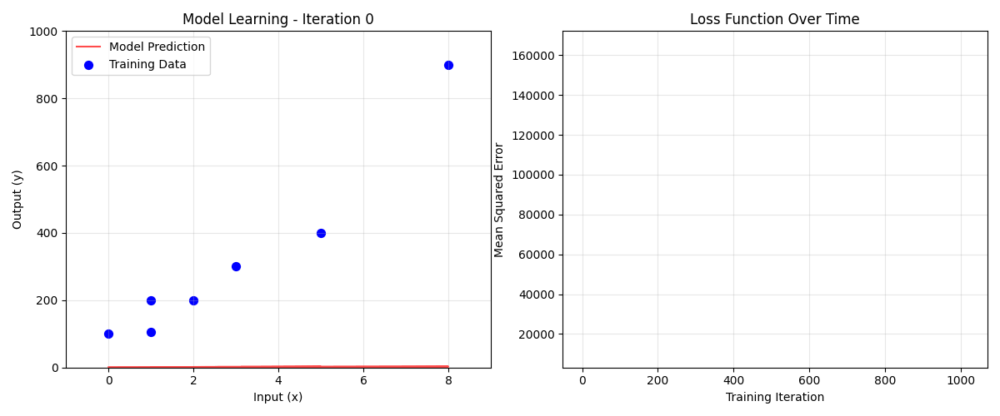

# ADAM Optimizer Implementation

Personal project implementing the original ADAM optimization algorithm from scratch, as described in the original paper.

## Overview

This project replicates the ADAM optimizer algorithm exactly as presented in the original research paper. It demonstrates gradient-based optimization on a linear regression problem with animated visualization showing the learning process.



## Features

- Full ADAM optimizer implementation from the original paper
- Manual gradient computation for linear regression
- Real-time animated visualization of model convergence
- Educational code structure for learning optimization algorithms

## Quick Start

```bash
poetry install
poetry run python src/adam_optimizer.py
```

## Output

The script generates:
- Console output showing training progress
- Animated visualization of the model learning process
- GIF saved to `.github/adam_optimization.gif`

## Requirements

- Python 3.13+
- Poetry 
